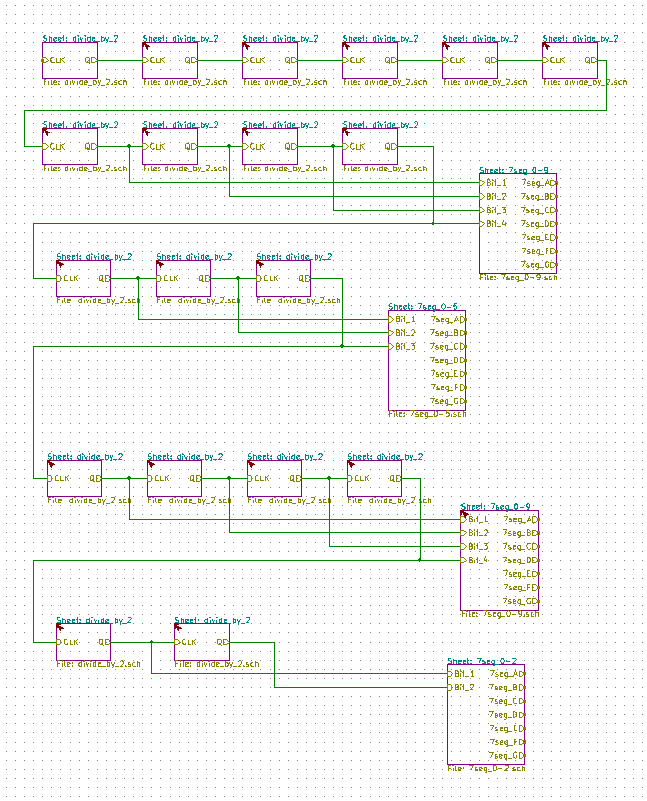
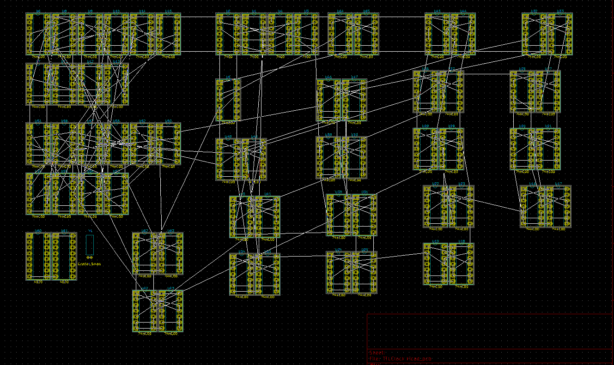

# Clock using only NAND Gates!
*WORK IN PROGRESS*

I got inspiration for this project from [Ahmed Mohamed](https://en.wikipedia.org/wiki/Ahmed_Mohamed_clock_incident) and his "bomb" clock.

I'm working on creating a clock using only 2-input NAND gates(negated and gate), a type of logic gate. 

NAND gates(as well as NOR gates) are functionally complete which means any equation using any combination of logical operators can be re-expressed using only NAND operators. A clock display output can be broken down into truth tables which can then be expressed as a circuit using NAND gates.

The original plan for this clock was to build a clock using an even more basic building block of circuitry, the transistor. But given the massive number of of NAND gates needed to accomplish this task, the actual assembly of the circuit would be incredibly time consuming.
To Do:  
- [x] BCD to 7 segment design
- [x] divide by two circuit
- [x] oscillator circuit design  
- [x] button debouncing  http://www.ganssle.com/debouncing-pt2.htm
- [ ] or gate block  
- [ ] dimmer(autodimmer? with photoresistor)
- [ ] PWM circuit http://forum.allaboutcircuits.com/threads/project-simple-pwm-circuit.9016/
http://electronics.stackexchange.com/questions/30737/transistors-and-pwm
- [ ] power supply circuit
- [ ] LED driver circuit

the 7400 chip

clock is made up of ~400 NAND gates

made up of 2 main components
- 31 divide-by-two blocks  
- 4 BCD to 7-Segment Display Decoders

starting PCB layout

